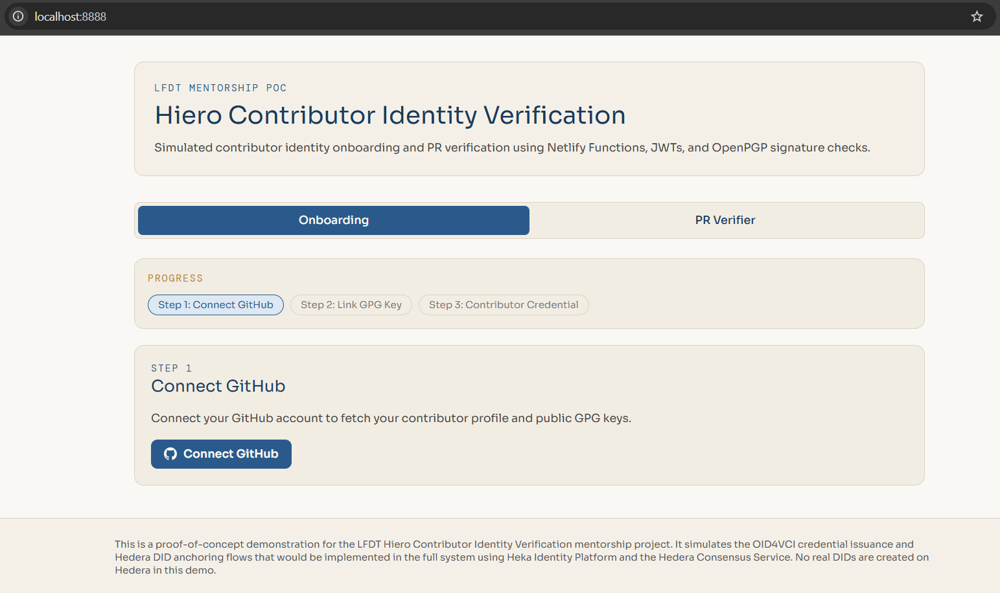
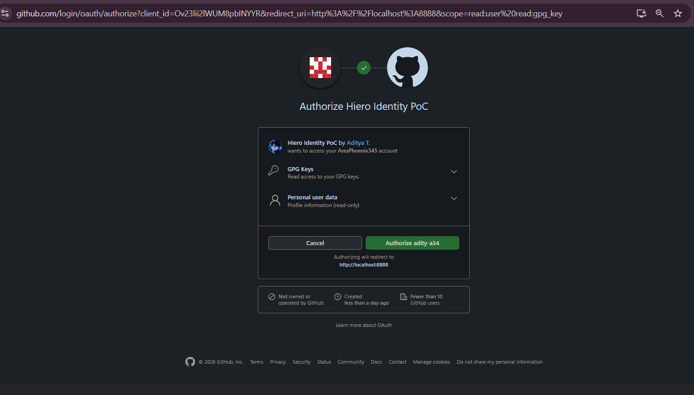
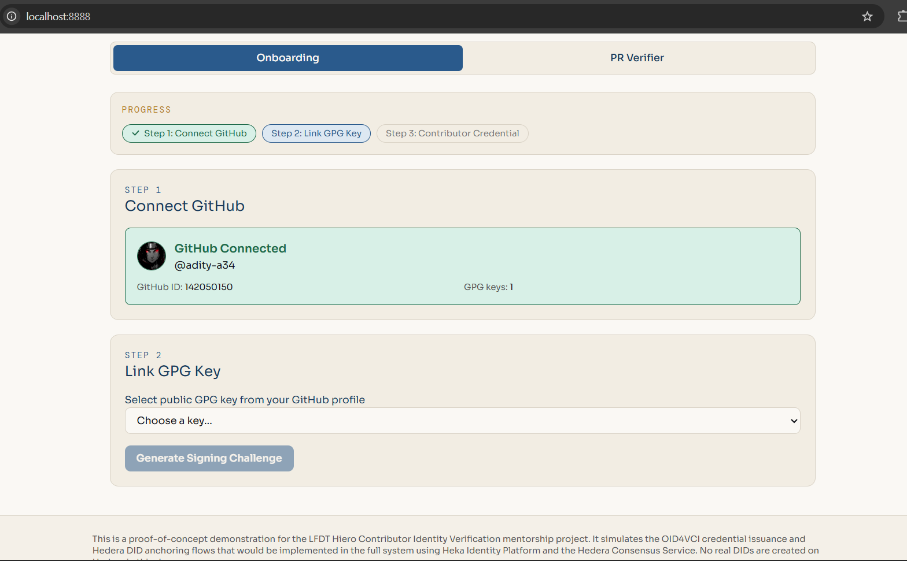
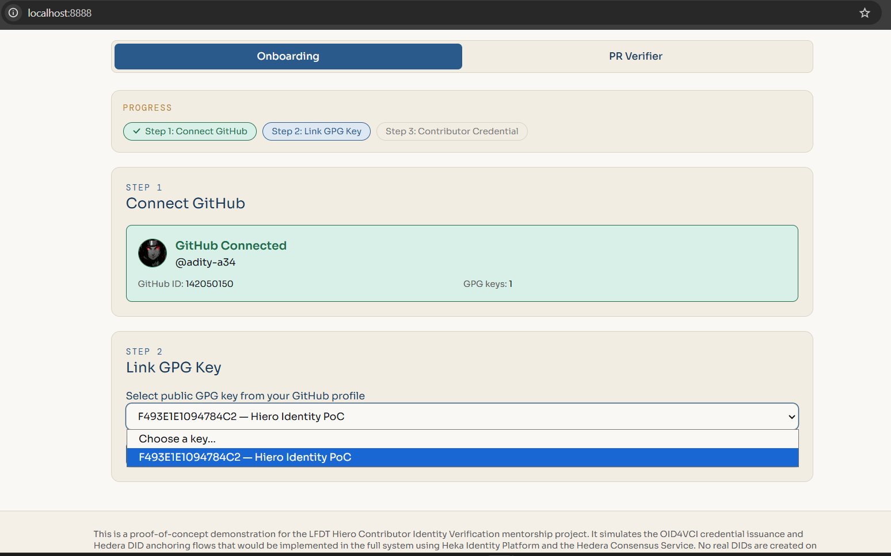
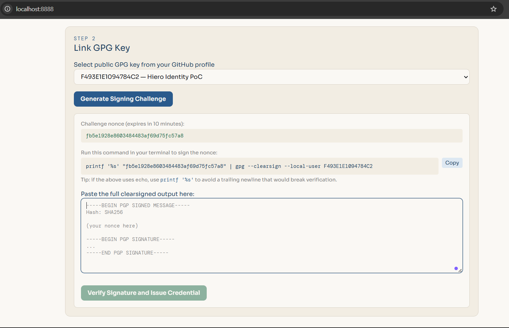
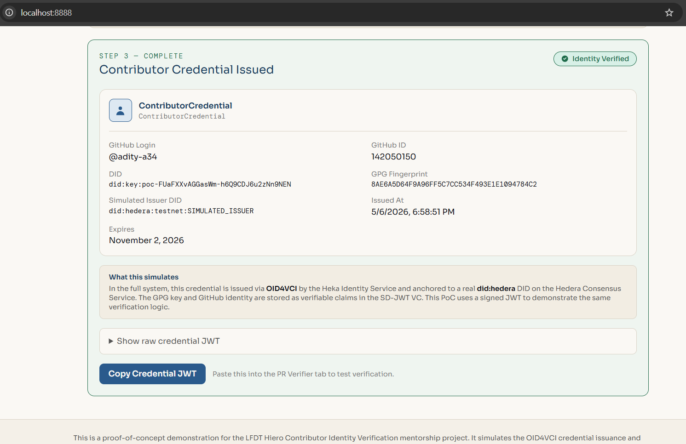
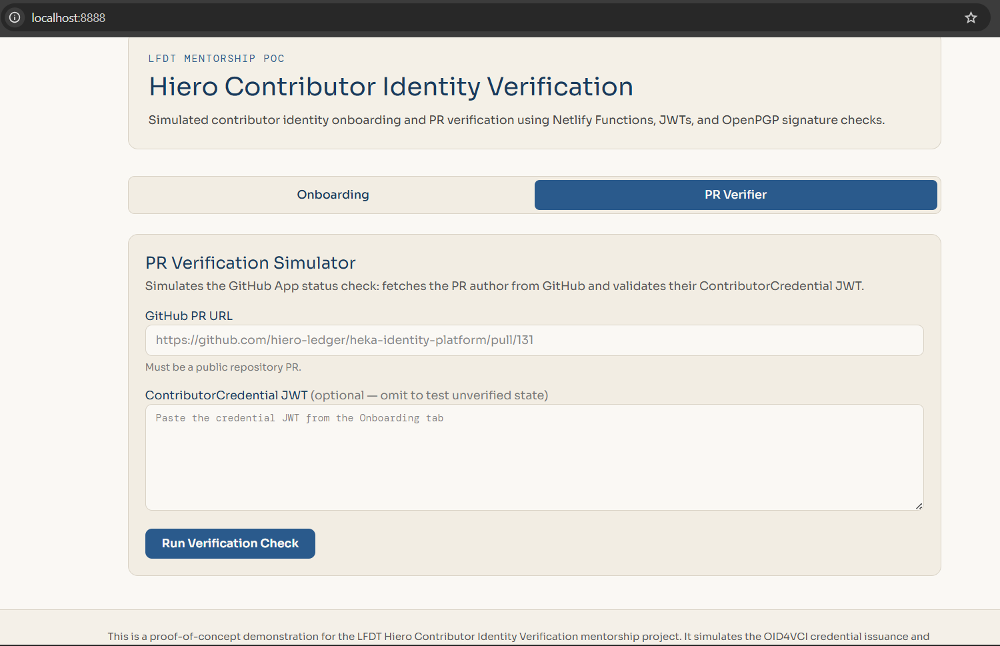
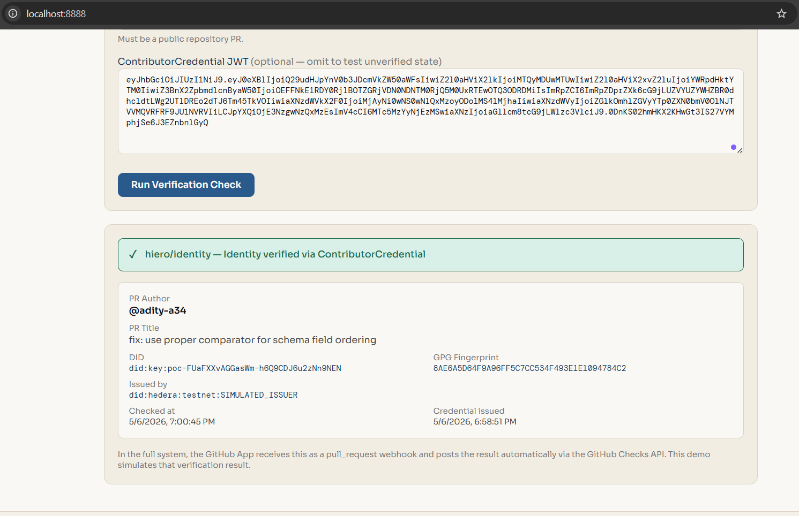

# Hiero Contributor Identity Verification, PoC

I built this as a proof-of-concept for the [LFDT Hiero Contributor Identity Verification](https://mentorship.lfx.linuxfoundation.org/project/64c64daa-ffdb-4871-82f5-01c1bdc7fecc/) mentorship project.

The stack is React 18, Vite, Tailwind CSS v4, and Netlify Functions. GPG verification runs through `openpgp` v6 and JWT signing through `jose` v6.

To run it locally, use `netlify dev` rather than `npm run dev` so the function routes resolve correctly.

---

## Part 1: Contributor Onboarding

This is the main flow. It walks a contributor through three steps to prove they own their GitHub account and a GPG key, then issues them a credential.

### Step 1: Connect GitHub

Clicking the button sends you to GitHub OAuth. I request `read:user` and `read:gpg_key` scopes. When you come back, the `github-auth` function exchanges the code for a token, pulls your profile and public GPG keys, and hands them to the frontend.

### Step 2: Link GPG Key

You pick one of the GPG keys on your GitHub profile. Clicking "Generate Signing Challenge" hits the `gpg-challenge` function, which returns a short-lived nonce wrapped in a JWT signed with `CHALLENGE_SECRET`. It expires in 10 minutes.

You then sign the nonce locally using the `gpg --clearsign` command shown on screen and paste the full PGP block back into the form.

The `gpg-verify` function handles the rest. It checks the challenge JWT is still valid and belongs to you, parses the clearsigned block with `openpgp`, verifies the signature against the public key fetched from GitHub, and confirms the signed text matches the nonce exactly.

### Step 3: Credential Issued

If everything checks out, `gpg-verify` issues a signed `ContributorCredential` JWT. It contains your GitHub login, GitHub ID, GPG fingerprint, a deterministic `did:key:poc-*` derived from both, and a simulated issuer DID. The credential is valid for 180 days.

You can copy the JWT from here and bring it over to Part 2.

---

## Part 2: PR Verifier

This simulates the status check a GitHub App would run when a pull request is opened.

You paste a public GitHub PR URL and, optionally, the `ContributorCredential` JWT from Part 1. The `verify-pr` function fetches the PR author from the GitHub API and runs the JWT through three possible outcomes:

- Verified: the JWT is valid, not expired, and the `github_login` claim matches the PR author
- Invalid: the JWT is present but fails verification or the login does not match the PR author
- Unverified: no JWT was provided, so the PR author is reported without any credential check

In the full system this check fires automatically via a `pull_request` webhook and posts the result through the GitHub Checks API. Here you trigger it manually by submitting the form.

---

## What I simulated

The full mentorship project anchors `did:hedera` DIDs on the Hedera Consensus Service, issues credentials via OID4VCI through Heka Identity Service, and handles presentation through Heka Wallet. I replaced all of that with a signed JWT and a deterministic `did:key:poc-*` to keep the whole thing deployable on Netlify while demonstrating the same verification logic end to end.

No real DIDs are created on Hedera in this demo.
